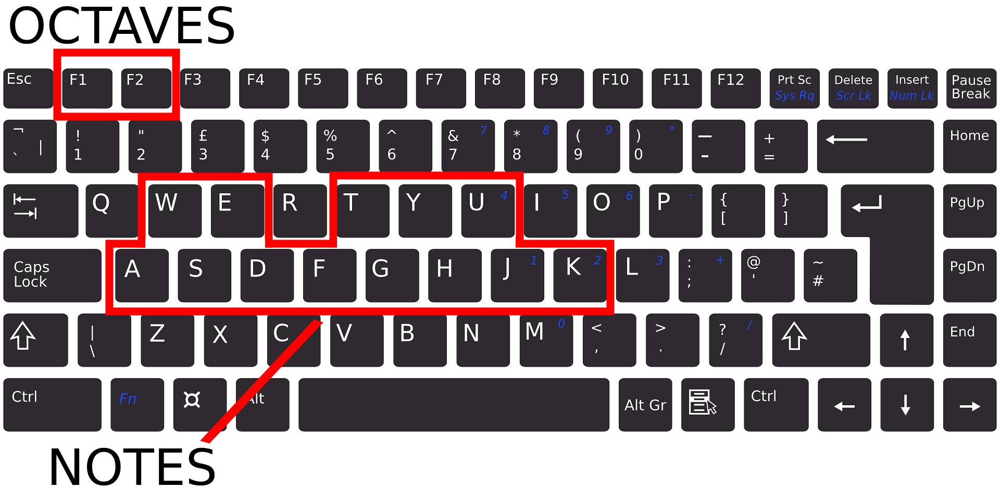

# Python Piano
 Virtual keyboard made in Python
___
# Dependencies
This program uses the Tkinter and the Pygame libraries for it's sound and GUI interface
___
# How to use
This keyboard has two ways to play:
- __Mouse__
- __Keyboard__
#
You can either click individual notes or use your keyboard to play the notes and you can only play one octave at a time.
This is the keyboard layout for the keys and octave change:

#
There is also a "Play Music" button, which plays a small tune on the piano.
If you want to hear a different tune, then click the red button next to this button.
___
## Minimum requirements
- __Storage__: 50 MB
- __OS__: Windows 10 or higher